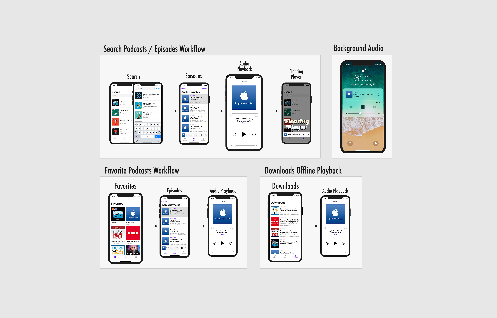

# MPodcasts

## Workflow

## About
You can learn about all the proper techniques to build out an Audio Player application. MPodcasts will be fully functional in terms of searching for available Podcasts on iTunes, bookmarking your favorite stations, and full support for audio playback. Furthermore, an Audio app wouldn't be complete without offline playback capabilities; which turns out is an extremely fun feature to build out. 

## Core Features
* Alamofire Integration to greatly simplify network requests architecture
* AVKit Audio Player libraries for audio playback
* Offline Playback of podcasts enabled through download feature
* Control playback when App is in background
* Draggable Floating Player component accessible across all screens
* Search for Podcasts through iTunes API
* Parsing JSON asynchronously
* Learn to use XML parsing Pods through Cocoapods integration
* User Favorites persistence with UserDefaults
